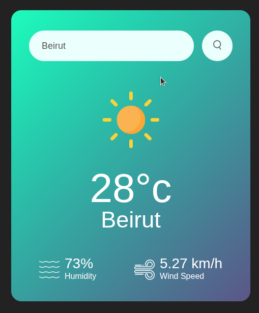

# Weather-App-JS

A simple weather application built with **HTML, CSS, and JavaScript** that fetches live weather data from the **OpenWeatherMap API**.

Users can search for a city and view key weather information in real time.

---

## Features

- Search weather by city name
- Displays:
  - Temperature
  - Humidity
  - Wind speed
  - Weather description/condition
- Fast, client-side UI (no backend required)

---

## Tech Stack

- HTML5
- CSS3
- JavaScript (Vanilla)
- OpenWeatherMap Current Weather API

---

## Getting an API key (OpenWeatherMap)

This project requires a free API key from OpenWeatherMap.

1. Create an account at: https://openweathermap.org/
2. Sign in and open your API keys page: https://home.openweathermap.org/api_keys
3. Create a key (or use the default one)
4. Wait a few minutes for activation if your first request fails

---

## Project Setup

### Option 1 — Quick local setup

Create a local file named `key.js` in the project root with:

```js
window.__OWM_API_KEY = "your_api_key_here";
```

> ⚠️ Do not commit your real API key.

### Option 2 — Recommended (safer)

Keep your key in a local, ignored file.

1. Create `key.js` in the project root:

```js
window.__OWM_API_KEY = "your_api_key_here";
```

2. Add `key.js` to `.gitignore`:

```bash
echo "key.js" >> .gitignore
```

3. Ensure `index.html` includes `key.js` before the app script:

```html
<script src="key.js"></script>
<script>
  // app code that reads window.__OWM_API_KEY
</script>
```

---

## Run Locally

You can run the app by:

- Opening `index.html` directly in your browser, or
- Serving the folder with a local static server

Then enter a city and click search to fetch weather data.

---

## Error Handling

Common issues and fixes:

- **Invalid city name** → Check spelling and try again.
- **401 Unauthorized** → Your API key is missing/invalid.
- **429 Too Many Requests** → You have hit your API rate limit.
- **No data returned** → Wait a few minutes after creating a new API key.
- **Network errors** → Check your internet connection or browser console.

---

## Screenshot

Add an app screenshot to improve the README preview.

Example:



---

## Live Demo

https://grace-hdd.github.io/Weather-App-JS/

---

## Security Notes

- Never commit API keys or secrets.
- If a key is exposed, rotate/regenerate it immediately.
- Remove accidentally committed secret files from Git history when necessary.

---

## License

This project is open source under the **MIT License**.

(You can add a `LICENSE` file to formalize this.)
